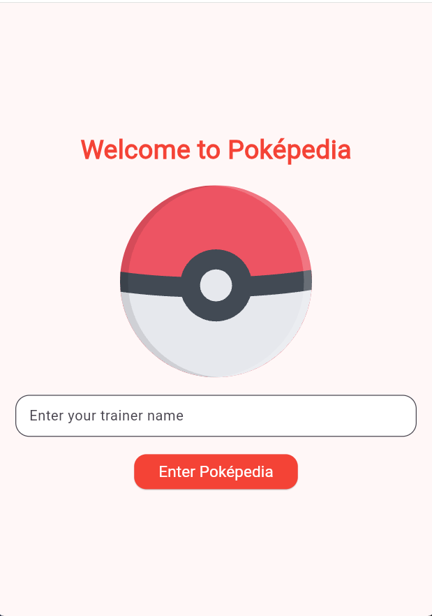
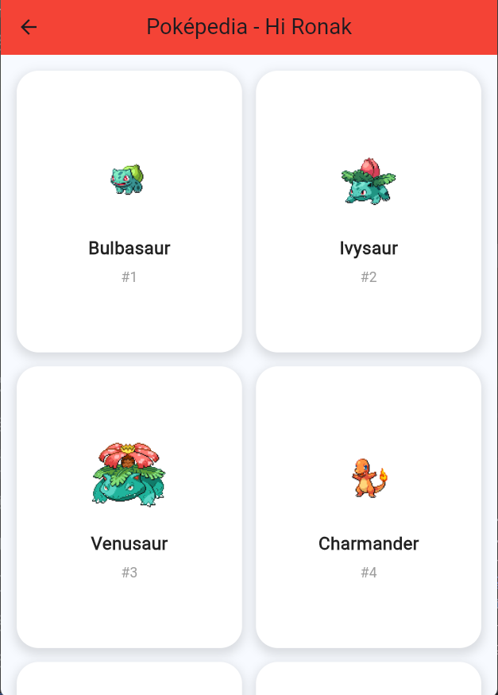
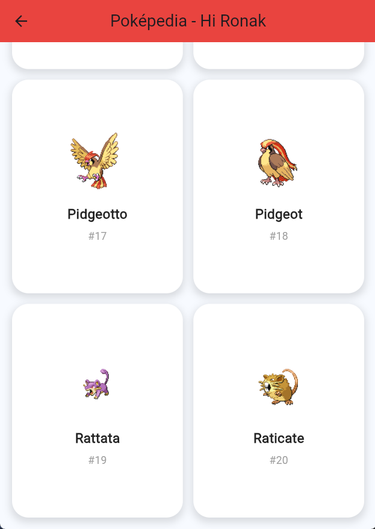

# Assignment 7 – Poképedia App

This Flutter project is a creative Poképedia app that includes a login screen, Lottie animation, and Pokémon data fetched from the PokéAPI.

---

## Features Implemented

- Login screen with trainer name input
- Lottie animation on welcome screen
- Pokémon list fetched from API
- Grid layout showing Pokémon images and names
- Loading indicator while fetching data
- Error handling if API fails
- Dynamic UI updates using setState()

---

## API Used

PokéAPI  
https://pokeapi.co/api/v2/pokemon?limit=20

---

## Packages Used

- http → for API requests  
- lottie → for animations  

---

## JSON Parsing

The app fetches Pokémon data from the PokéAPI and parses the JSON response using `jsonDecode()`.

From the JSON response, the app extracts:

- `name` → Pokémon name
- `url` → used to derive Pokémon ID
- Pokémon image displayed using sprite URL

---

## Screenshots

